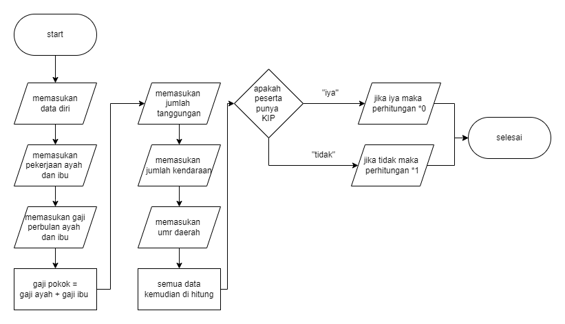

# PERHITUNGAN UKT MAHASISWA PERGURUAN TINGGI

## STUDI KASUS
UKT merupakan dana kuliah yang harus dibayarkan mahasiswa per semester, dengan besaran yang berbeda-beda berdasarkan kesanggupan ekonomi orang tua atau walinya. Sedangkan kemampuan tersebut terukur melalui  penghasilan dan jumlah tanggungan keluarga.disini saya lebih ke menghitung biaya UKT secara teoritis dan semasuk akal mungkin.

## FLOWCHART

## PENJELASAN PROGRAM PYTHON
1.  program dimulai
2.  peserta memasukan data diri sendiri dan data diri orang tua
3.  peserta peserta memasukan gaji orang tua, tanggungan, jumlah kendaraan, luas rumah
4.  peserta memasukan umr daerah sendiri
5.  hasil gaji dan lainnya di hitung
6.  apabila peserta memiliki KIP maka hasilnya ukt nya menjadi 0 atau kuliahnya gratis
7.  namun apabila peserta tidak memiliki kip maka hasil kalkulasi tersebut *1 atau kuliah ber ukt
